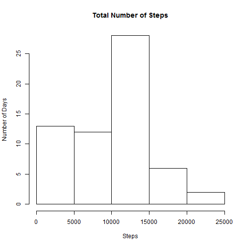
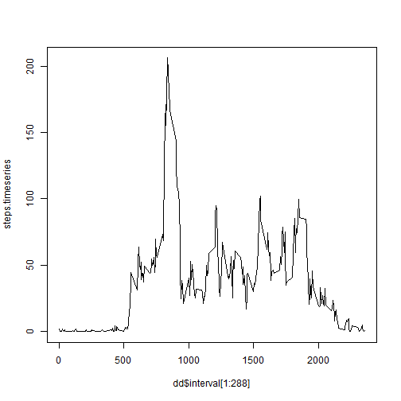
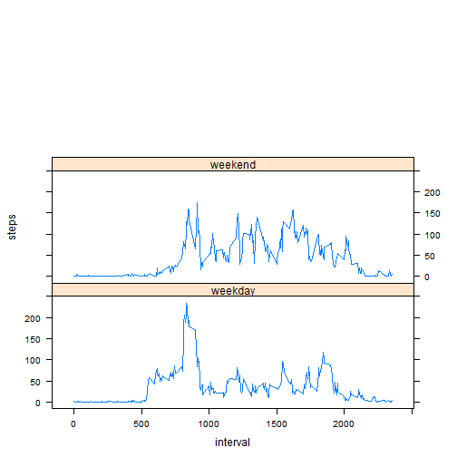

Personal Movement Data Analysis
========================================================

Loading and preprocessing the data

```r
setwd('C:/Users/Yan/Documents/RCourse/reproducibleResearch')
dd <- read.csv("activity.csv",sep=",",header=TRUE)
summary(dd)
```

```
##      steps               date          interval   
##  Min.   :  0.0   2012-10-01:  288   Min.   :   0  
##  1st Qu.:  0.0   2012-10-02:  288   1st Qu.: 589  
##  Median :  0.0   2012-10-03:  288   Median :1178  
##  Mean   : 37.4   2012-10-04:  288   Mean   :1178  
##  3rd Qu.: 12.0   2012-10-05:  288   3rd Qu.:1766  
##  Max.   :806.0   2012-10-06:  288   Max.   :2355  
##  NA's   :2304    (Other)   :15840
```

What is mean total number of steps taken per day?
Make a histogram of the total number of steps taken each day

```r
ddd<-tapply(dd$steps,dd$date,FUN=sum, na.rm=TRUE)
hist(ddd,xlab="Steps",ylab="Number of Days",main="Total Number of Steps")
```

 

Calculate and report the mean and median total number of steps taken per day

```r
mean(ddd)
```

```
## [1] 9354
```

```r
median(ddd)
```

```
## [1] 10395
```

What is the average daily activity pattern?
Make a time series plot (i.e. type = "l") of the 5-minute interval (x-axis) and the average number of steps taken, averaged across all days (y-axis)

```r
steps.timeseries<-tapply(dd$steps,dd$interval,FUN=mean, na.rm=TRUE)
plot(dd$interval[1:288], steps.timeseries, type="l") 
```

 

Which 5-minute interval, on average across all the days in the dataset, contains the maximum number of steps?

```r
which.max(steps.timeseries)
```

```
## 835 
## 104
```

Imputing missing values
Calculate and report the total number of missing values in the dataset

```r
sum(is.na(dd$steps))
```

```
## [1] 2304
```

Create a new dataset that is equal to the original dataset but with the missing data filled in

```r
for (j in 1:length(dd$steps)){
  if (is.na(dd$steps)[j]==TRUE) {
    dd$steps[j]<-tapply(dd$steps,dd$date,FUN=mean,na.rm=TRUE)[j%/%288+1]
  }
}
for (j in 1:length(dd$steps)){
  if (is.na(dd$steps)[j]==TRUE) {
    dd$steps[j]<-tapply(dd$steps,dd$date,FUN=mean,na.rm=TRUE)[j%/%288]
  }
}
```

```
## Error: replacement has length zero
```

Make a histogram of the total number of steps taken each day and Calculate and report the mean and median total number of steps taken per day. Do these values differ from the estimates from the first part of the assignment? What is the impact of imputing missing data on the estimates of the total daily number of steps?

```r
ddd1<-tapply(dd$steps,dd$date,FUN=sum, na.rm=TRUE)
hist(ddd1,xlab="Steps",ylab="Number of Days",main="Total Number of Steps")
```

 

```r
mean(ddd1)
```

```
## [1] 9357
```

```r
median(ddd1)
```

```
## [1] 10395
```

Are there differences in activity patterns between weekdays and weekends?
Show a panel plot comparing the average number of steps taken per 5-minute interval across weekdays and weekends

```r
days=rep(NA,length(dd$date))
for (k in 1:length(dd$date)){
  if (weekdays(as.Date(dd$date[k])) %in% c("Sunday","Saturday")){
    days[k]<-"weekend"
  }
  else{
    days[k]<-"weekday"
  }
}
dd1<-cbind(dd,days)
dd2<-split(dd1,dd1$days)

tsweekday<-tapply(dd2$weekday$steps,dd2$weekday$interval,FUN=mean,na.rm=TRUE)
tsweekend<-tapply(dd2$weekend$steps,dd2$weekend$interval,FUN=mean,na.rm=TRUE)
steps1<-c(tsweekday,tsweekend)
days1<-c(rep("weekday",length(tsweekday)),rep("weekend",length(tsweekend)))
interval1<-c(dd$interval[1:288],dd$interval[1:288])
step_days<-data.frame(step1=steps1,days1=days1,interval1=interval1)

library("lattice")
xyplot(step_days$step1~step_days$interval1|step_days$days1,type = "l",xlab="interval",ylab="steps",layout=c(1,3))
```

 
